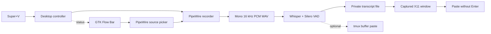

# Vox

[](https://github.com/yuribodo/vox/actions/workflows/ci.yml)
[](LICENSE)

[Website](https://yuribodo.github.io/vox/) · [Install](#install-and-start-using-vox) · [Architecture](docs/architecture.md) · [Security](SECURITY.md)

**Private, local push-to-talk dictation for Linux. Speak, review, then send.**

Vox records from PipeWire, transcribes locally with Whisper, and pastes the
result into the text field you started from. A compact Flow Bar shows the live
microphone level, recording time, processing state, and friendly errors.

No cloud service is involved during dictation. Vox never presses Enter,
submits a prompt, or executes transcribed text.

> [!IMPORTANT]
> The current desktop build is an English-first, machine-targeted prototype for
> Cinnamon on X11 and an NVIDIA GPU with CUDA compute capability 8.6. See
> [Current limitations](#current-limitations) before installing it elsewhere.

> [!NOTE]
> This fork targets **GNOME on Wayland, CPU-only inference** (no NVIDIA/CUDA
> required) — tested on Fedora with an Intel Iris Xe iGPU. It swaps X11/`xdotool`
> paste for `wl-clipboard`+`ydotool`, drops the CUDA build path in favor of a
> plain CPU `whisper.cpp` build (`medium-q8_0` model, greedy decoding and a
> shortened `--audio-ctx` for speed),
> and replaces the GTK overlay (broken on mutter — GNOME doesn't implement
> `wlr-layer-shell`) with a GNOME Shell extension in
> `scripts/gnome-extension/vox-overlay@dvdev/` that renders always-on-top
> inside gnome-shell itself. **Linux only — there is no Windows build or plan
> to support one.**

## How it feels

1. Focus any text field.
2. Press `Super+V`.
3. Confirm the microphone shown in the Flow Bar; click its name to switch if
   needed.
4. Speak while the Flow Bar reacts to your voice.
5. Press `Super+V` again.
6. Review the pasted text and press Enter yourself when it is ready.

`Ctrl+Alt+Space` is installed as a fallback shortcut.

## Features

- Global toggle-to-talk shortcut on Cinnamon/X11.
- Minimal Flow Bar with a `REC` indicator, live waveform, timer, and current
  microphone selector.
- Safe live microphone switching: partial audio is discarded and recording
  restarts on the selected PipeWire source without changing the destination.
- Fully local Whisper large-v3-turbo Q8_0 inference through whisper.cpp.
- Silero VAD to reject silence and reduce hallucinations.
- Exact Unicode and multiline paste into native X11 applications.
- Captured destination window: changing focus while speaking does not redirect
  the final text.
- Clipboard restoration after paste for existing text or image content.
- Direct tmux insertion path for terminal-native workflows.
- No automatic Enter under any insertion path.
- Reproducible, checksum-pinned model and runtime preparation.

## Requirements

The checked-in setup is intentionally narrow and matches the machine used to
benchmark the project.

| Area | Requirement |
| --- | --- |
| OS/session | Linux, Cinnamon desktop, X11 |
| Audio | PipeWire with `pw-record`/`pw-dump`; WirePlumber with `wpctl` |
| Desktop integration | Python 3, PyGObject, GTK 3, `xdotool`, `jq`, `flock`, `setsid` |
| Build | Go 1.26, Git, curl, tar, SHA-256 tools, Make |
| Inference | NVIDIA driver, CUDA toolkit, GCC/G++ 15 |
| GPU target | CUDA compute capability 8.6 |
| Optional terminal path | tmux |

The desktop integration has been tested only on Arch Linux and CachyOS. Install
the matching packages there with:

```bash
sudo pacman -S --needed \
  go git curl tar make coreutils util-linux \
  pipewire-audio wireplumber tmux xdotool jq python-gobject gtk3 \
  cuda gcc15
```

Users of another distribution need to translate those package names and must
still provide GCC/G++ 15, CUDA, Cinnamon/X11, and the commands in the table
above. The model preparation script downloads its own pinned CMake binary; it
does not use or install a system CMake package.

## Install and start using Vox

### 1. Download and build

```bash
git clone https://github.com/yuribodo/vox.git
cd vox

make build
./vox version
```

The version command should print `vox 0.1.0`.

### 2. Prepare the local inference runtime

```bash
make fetch-whisper
make doctor
```

`make fetch-whisper` downloads the pinned model, VAD model, source, tools, and
build artifacts, then compiles whisper.cpp locally. Expect roughly 1.3 GiB of
disk use and an 834 MiB model download. The first run can take several minutes,
depending on the connection and CPU.

`make doctor` should report `ok` for PipeWire, the Wayland clipboard tools
(`wl-copy`, `wl-paste`, `ydotool`), and the Whisper runtime/model. tmux is
required only for the terminal-specific insertion commands. Do not install the shortcut until these
checks pass; use the [troubleshooting guide](docs/troubleshooting.md) if one is
reported as unavailable.

### 2b. Prepare the offline translator (optional)

By default the shortcut pastes what you actually said, in the language you said
it — that is what whisper does most accurately. Translation is off.

If you want English out, this installs a local Argos pt→en model and
`VOX_TRANSLATE_TO_EN=1` turns it on as a second step after transcription. Do not
use whisper's own one-pass `--translate` for this: measured on the same audio it
took 11.6 s against 6.4 s for plain transcription, and was no more faithful —
translation of any kind swaps words on the way.

```bash
python3 -m venv .local/venv-translate
.local/venv-translate/bin/pip install ctranslate2 sentencepiece
curl -fL -o /tmp/pt_en.argosmodel https://argos-net.com/v1/translate-pt_en-1_9.argosmodel
mkdir -p .local/models/translate-pt-en
python3 -c "import zipfile; zipfile.ZipFile('/tmp/pt_en.argosmodel').extractall('/tmp/argos')"
cp /tmp/argos/translate-pt_en-1_9/sentencepiece.model .local/models/translate-pt-en/
cp -r /tmp/argos/translate-pt_en-1_9/model .local/models/translate-pt-en/
```

Roughly 300 MiB of disk. Everything runs locally; nothing is sent anywhere.
Translation itself costs about 0.35 s per dictation.

Skip this step entirely to keep transcripts in Portuguese, which is the
default. Even with the venv installed, `vox-desktop-toggle.sh` translates only
when `VOX_TRANSLATE_TO_EN=1`, and if the translator fails it pastes the
Portuguese transcript rather than losing the dictation.

To use whisper's one-pass translation anyway, set `VOX_WHISPER_TRANSLATE=1`
together with `VOX_WHISPER_AUDIO_CTX=0` — the shortened audio context that makes
transcription 30% faster makes that translation take 83 s.

### 3. Install the desktop shortcuts

Run this from a graphical Cinnamon/X11 session:

```bash
make desktop-shortcut
```

This installs `Super+V` and the fallback `Ctrl+Alt+Space` for the current user.
The shortcut points to this checkout, so keep the repository in place. If it is
moved, rebuild Vox and run `make desktop-shortcut` again.

### 4. Make the first dictation

1. Focus an editable text field.
2. Press `Super+V` and confirm that the Flow Bar says `REC`.
3. Speak in English.
4. Press `Super+V` again and wait for the text to be pasted.
5. Review the text and press Enter yourself only when it is ready.

If `Super+V` is already used by another application, use `Ctrl+Alt+Space`. Vox
does not need a background daemon or login service.

### Remove the desktop shortcuts

```bash
make remove-desktop-shortcut
```

The installer and remover are idempotent. They manage only the two Vox custom
keybindings and refuse to replace another custom shortcut using the same keys.

## What happens during a dictation



On the first shortcut press, the desktop controller captures the active X11
window and starts `pw-record`. The overlay observes private runtime state and
reads the tail of the growing WAV to render the real microphone level.

The microphone name on the right side of the Flow Bar is clickable. Choosing
another source updates PipeWire's default, safely cancels and discards the
partial recording, and immediately starts a new recording on that explicit
source. The timer restarts, while the originally captured destination window
is preserved. The discarded audio is never transcribed or pasted.

On the second press, Vox finalizes the WAV, runs local inference, writes the
exact transcript to a private file, reactivates the captured window, and sends
`Ctrl+V`. It temporarily owns the clipboard only for the paste and restores the
previous text or image afterward.

Successful dictations delete their temporary audio, transcript, and state.
Failures preserve useful recovery artifacts and expose a short message in the
Flow Bar; technical detail stays in the runtime logs.

## Language behavior

Vox currently forces Whisper's decoder language to English with `-l en`. This
is deliberate: the accepted benchmark, context vocabulary, and target workflow
are all English coding prompts.

- Spoken English is transcribed as English.
- Spoken Portuguese may sometimes produce English-looking output because the
  decoder is being told to interpret the audio as English.
- That behavior is **not a translation mode** and is not reliable translation.
- There is currently no runtime language switch.

The English-first default remains enabled because it performs well for the
current workflow. Configurable transcription and explicit translation modes
are not supported by this release.

## Model provenance and research

The speech-recognition model behind Vox is **Whisper large-v3-turbo**, created
by [OpenAI](https://openai.com/index/whisper/). The Whisper family was
introduced in 2022 and trained from 680,000 hours of multilingual and
multitask audio supervision.

Its foundational paper is
[*Robust Speech Recognition via Large-Scale Weak Supervision*](https://cdn.openai.com/papers/whisper.pdf)
by Alec Radford, Jong Wook Kim, Tao Xu, Greg Brockman, Christine McLeavey, and
Ilya Sutskever. There is no separate research paper specifically for Turbo.

OpenAI [released large-v3-turbo in 2024](https://github.com/openai/whisper/discussions/2363)
as an optimized, fine-tuned version of large-v3. It reduces the decoder from 32
layers to 4, making inference substantially faster with a small expected
quality tradeoff. It was fine-tuned for transcription rather than translation;
the [official model card](https://huggingface.co/openai/whisper-large-v3-turbo)
describes the checkpoint and links back to the original Whisper paper.

Vox does not load OpenAI's full-precision PyTorch checkpoint directly. It uses
the official `large-v3-turbo` Q8_0 GGML conversion through the independent,
MIT-licensed [whisper.cpp](https://github.com/ggml-org/whisper.cpp) runtime.
Q8_0 reduces storage and working memory; it does not change the model's OpenAI
provenance. Silero VAD is a separate speech-activity detector used before
decoding to reject silence.

## Safety and privacy

Vox treats every transcript as untrusted text.

- It never sends Enter or appends a newline to submit content.
- The tmux path loads text through stdin into a named tmux buffer; transcript
  contents never become shell arguments.
- Runtime state lives under `${XDG_RUNTIME_DIR}/vox` (normally
  `/run/user/$UID/vox`, with `/tmp/vox-$UID` as fallback) in a private `0700`
  directory owned by the current user.
- Transcript and state files use `0600` permissions.
- Whisper's generated output stays inside a private temporary directory, and
  the paste helper never requests clipboard-manager persistence for a
  transcript.
- Recorder state is bound to the Linux process start time before Vox sends a
  signal, preventing a stale PID from targeting an unrelated process.
- Model inference is local. Network access is used only by the explicit model
  preparation scripts.
- Private benchmark audio, manifests, generated transcripts, model weights,
  and local runtimes are gitignored.
- Failed audio is preserved so it can be inspected or recovered. The user
  runtime directory is normally cleared when the login session or machine ends.

See [Architecture and safety invariants](docs/architecture.md) and the
[security audit](docs/security-audit.md) for the full state machine, threat
model, residual risks, and verification record.

## Command reference

```text
vox version
vox doctor
vox record --output <path> [--source <pipewire-node>]
vox transcribe [--hotwords <path>] <audio-path>
vox benchmark --manifest <path> [--report <path>]
vox insert --target <tmux-pane> [--text <text> | --stdin]
vox toggle (--target <tmux-pane> | --output <path>)
  [--source <pipewire-node>]
vox cancel
```

### Record and transcribe a WAV

```bash
./vox record --output prompt.wav
# Press Ctrl-C once after speaking.

./vox transcribe prompt.wav
```

`record` publishes a valid finalized WAV without overwriting an existing file.
`transcribe` uses Whisper by default and prints the recognized text to stdout;
timing metrics are written to stderr.

### Insert safely into tmux

```bash
printf '%s' 'Review this function.' | \
  ./vox insert --target "$TMUX_PANE" --stdin
```

The text appears in the pane's editable input but is not submitted.

### Toggle recording directly from tmux

Run the same command once to start and once to stop:

```bash
./vox toggle --target "$TMUX_PANE"
```

An optional tmux binding is:

```tmux
bind-key -n C-Space run-shell -b \
  'cd /absolute/path/to/vox && ./vox toggle --target "#{pane_id}"'
```

### Write a toggle transcript to a file

```bash
./vox toggle --output /absolute/path/to/transcript.txt
# Speak, then run the exact command again.
```

The destination must be absolute and must not already exist. Vox writes the
exact transcript with `0600` permissions and no trailing newline.

`vox cancel` stops and deletes the active partial recording without running
inference or changing the captured destination. The desktop uses it internally
when switching microphones.

## Configuration

| Variable | Default | Purpose |
| --- | --- | --- |
| `VOX_THREADS` | `8` | Override Whisper inference thread count |
| `VOX_WHISPER_BIN` | Project-local binary | Override `whisper-cli` path |
| `VOX_WHISPER_MODEL` | Project-local Q8_0 model | Override Whisper model path |
| `VOX_WHISPER_VAD_MODEL` | Project-local Silero model | Override VAD model path |

## Benchmarked configuration

Whisper large-v3-turbo Q8_0 is the supported inference configuration. It was
measured on the target notebook before the public release.

| Whisper gate | Result |
| --- | --- |
| Context-prompt technical-term recall | 95.8% |
| Exact identifier accuracy | 100% (6/6) |
| Silence/noise hallucinations | 0/3 |
| Median 20-second inference | 493 ms |
| Sequential personal runs | 47 without OOM |

The sanitized evidence is in
[the Whisper benchmark report](artifacts/whisper-benchmark-report.md).

## Performance and resource impact

Vox has no daemon or resident model. Cinnamon stores the shortcut, but the
recorder, Flow Bar, controller, and Whisper process exist only for an active
dictation. An idle check on the target notebook found no Vox, whisper.cpp,
PipeWire recorder, or overlay process.

Measured on the target Ryzen 7 5800H / RTX 3050 Laptop GPU / 15.5 GiB RAM
notebook:

| Measurement | Result |
| --- | ---: |
| Idle Vox CPU/RAM/VRAM | No resident process |
| Active model file on disk | ~834 MiB |
| Isolated 20-second inference peak RSS | ~504 MiB |
| Isolated 20-second inference peak process VRAM | 1,230 MiB |
| Median 20-second inference | 493 ms |
| Sequential personal benchmark | 47/47 completed; no OOM |
| Current 12.86-second cold recheck | 1.44 s wall; 562 ms inference |
| Current recheck real-time factor | 0.044 (about 23x faster than real time) |
| Processes immediately after recheck | None remaining |

The Q8_0 quantization keeps the active model and its runtime memory footprint
smaller than a full-precision build. CUDA concentrates the expensive work into
a short burst after recording stops; the operating system and driver reclaim
the process RAM and VRAM when it finishes.

This means Vox should not reduce normal notebook performance between
dictations. During inference it can still briefly compete with another heavy
GPU/CPU workload, increase power draw, or cause a momentary stutter. The tests
establish bounded transient use and clean resource release on this notebook;
they are not a promise of zero contention on different hardware.

See [Performance evidence and interpretation](docs/performance.md) for the
method, limits, and practical guidance.

## Current limitations

- Desktop shortcut installation supports Cinnamon/X11 only.
- Wayland-native focus and paste are not implemented.
- English is hardcoded as the decoder language.
- The whisper.cpp build script targets NVIDIA compute capability 8.6 and
  explicitly uses GCC/G++ 15.
- Inference is record-then-transcribe, not streaming partial transcription.
- The model starts for every completed dictation; there is no persistent daemon.
- There is no settings window, transcript history, dictionary UI, or autostart
  service.
- Clipboard restoration covers prior text and image content.

## Troubleshooting

Start with:

```bash
make doctor
```

Runtime status and technical logs are private to the current user session:

```bash
runtime_dir="${XDG_RUNTIME_DIR:+${XDG_RUNTIME_DIR}/vox}"
runtime_dir="${runtime_dir:-/tmp/vox-$(id -u)}"
jq . "$runtime_dir/desktop-status.json"
tail -n 40 "$runtime_dir/desktop-command.log"
tail -n 40 "$runtime_dir/desktop-overlay.log"
```

See the [troubleshooting guide](docs/troubleshooting.md) for shortcut,
recording, overlay, paste, empty-audio, and model setup issues.

## Development

```bash
make test       # go test -race ./...
make verify     # tests plus go vet ./...
make build
```

The CI workflow runs the race-enabled Go tests and `go vet` on every push and
pull request.

### Landing page

The public website is a Next.js App Router project under `site/`. It requires
Node.js 20.9 or newer; CI and the checked-in `.nvmrc` use Node.js 24.

```bash
cd site
npm ci
npm run dev
```

Before publishing changes, run `npm run lint`, `npm run typecheck`, and
`npm run build`. The Pages workflow creates a static export and deploys it from
`site/out`; the landing page does not require a production Node.js server.

### Project map

| Path | Responsibility |
| --- | --- |
| `cmd/vox` | CLI commands and Whisper configuration |
| `internal/asr` | whisper.cpp adapter |
| `internal/record` | Safe PipeWire WAV recording |
| `internal/toggle` | Two-step recording state machine |
| `internal/tmux` | Exact no-submit tmux insertion |
| `scripts/vox-desktop-toggle.sh` | Desktop orchestration and friendly status |
| `scripts/vox-overlay.py` | GTK Flow Bar and live audio meter |
| `scripts/vox_audio_sources.py` | Enumerate and select PipeWire microphones |
| `scripts/paste-x11.py` | Captured-window paste and clipboard restoration |
| `scripts/install-desktop-shortcut.py` | Idempotent Cinnamon shortcuts |
| `benchmarks` | Private-dataset harness and public example manifest |
| `artifacts` | Sanitized benchmark evidence |
| `site` | Next.js public landing page and static export configuration |

## Further documentation

- [Architecture and safety invariants](docs/architecture.md)
- [Security audit and threat model](docs/security-audit.md)
- [Copyright and license audit](docs/licensing-audit.md)
- [Third-party notices](THIRD_PARTY_NOTICES.md)
- [Performance evidence and interpretation](docs/performance.md)
- [Troubleshooting](docs/troubleshooting.md)
- [Pinned dependencies and licenses](docs/dependencies.md)
- [Manual tmux integration checklist](docs/manual-integration.md)
- [Benchmark dataset and procedure](benchmarks/README.md)
- [Contributing](CONTRIBUTING.md)
- [Changelog](CHANGELOG.md)
- [Security policy](SECURITY.md)
